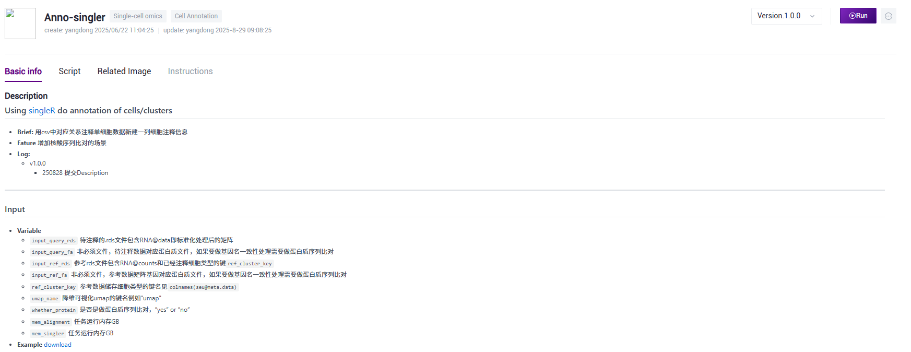

# Annos: A conclusion of single-cell annotion with mutiple methods
A tissue includes various cells with different cell types, precise annotation and clear distinction are indispensable. Single cell RNA sequencing (scRNA-seq) has revolutionized the way we study gene expression at the individual cell level. However, once you’ve performed clustering to group similar cells together, you’re faced with one of the most challenging tasks in scRNA-seq analysis: annotating your clusters. Cluster annotation is the process of assigning biological meaning to these groups, essentially identifying the cell types or states that each cluster represents.

---
# 植物单细胞注释protocol
- **Log**
  - 250829

## 1.1 利用高质量参考转录组，投影注释（singleR）
- **Workflow** [Anno-singler](https://github.com/ydgenomics/Annos/tree/main/Anno-singler)

- **Database**
  - 各物种单细胞数据 [scplantdb](https://biobigdata.nju.edu.cn/scplantdb/home)
  - 拟南芥各组织转录组 [NCBI website](https://www.ncbi.nlm.nih.gov/geo/query/acc.cgi?acc=GSE226097)
  - 其他物种根茎叶10kp云平台已下载数据 /Files/Chara/

## 1.2 利用已有marker基因集注释（scType，AUCell）
- **Workflow:** [Anno-sctype](https://github.com/ydgenomics/Annos/tree/main/Anno-sctype)

- **XSpeciesSpanner:** 需要准备好cluster特异基因列表(直接用FindAllMarkers的结果)和基因对应的蛋白质序列(.fa) [Website](https://shoot.plantcellatlas.com/#/annotate) [Article](https://www.cell.com/cell/fulltext/S0092-8674(25)00858-X)

- **Database**
  - [markers of scplantdb](https://biobigdata.nju.edu.cn/scplantdb/marker)
  - [markers of plantscrnadb](http://ibi.zju.edu.cn/plantscrnadb/#/)
  - [markers of PlantCellMarker](https://www.tobaccodb.org/pcmdb/homePage)

## 1.3 利用marker基因手动注释（查文献）
- **Brief:** **大量**marker基因在一个或多个cluster中特异表达，就可以暗示这个或这些cluster为对应细胞类型

- **什么是marker基因和高质量marker基因?** 在一个特定的细胞类型中特异性高表达，而在其他细胞类型中表达较低或不表达，最好寻找经过原位杂交验证的marker基因。单细胞聚类：将相似的细胞聚为一个cluster，一个cluster的细胞是潜在的一种细胞类型。
- **查找同源marker基因：** 对于注释不出来的细胞类型，可查找FindAllMarkers的top基因，查找其是否为已研究基因，是否具有组织特异性。可下载模式物种的蛋白文件，快速查看top基因是否为已研究基因，是否具有组织特异性。并对细胞类型进行判断。[UniProt website](https://www.uniprot.org/)

- **特异基因富集：** 对FindAllMarkers的基因，进行富集分析，结合生物学知识，对细胞类型进行判断。

- **实验验证:** 可选取未注释出来的cluster的FindAllMarkers基因，进行原位杂交，查看其组织特异性，确认cluster的细胞类型。

## 1.4 跨物种比较注释
- **Workflow:** SAMap

- **Brief:** 寻找高质量的近缘物种的单细胞转录数据，通过SAMap进行细胞相似性比较，并查找FindAllMarkers的top基因是否为已研究基因及富集结果，确定注释。

## 当前基于云平台流程的注释解决方案
**Brief** 一般对于批次小(同一次实验的多个生物学重复)的数据做整合后一起分群注释，**Dataget**产出`dotplot.pdf`看看有没有明显特异的marker基因(大概率很少🐶);`leiden_res_0.50`的`marker.csv`做基因富集(运行**Enrich**)，看各个群的特异基因主要功能是什么，特异的细胞类型有特异的功能; **eplant**对拟南芥数据整理的很好，可以利用其中转录组模块做一定参考 [ePlant-web版可视化功能基因组学工具](https://mp.weixin.qq.com/s/DHLZQWFRniOrlf935MOuqA)；自动注释方面，如果该物种有整理的*细胞类型-marker基因列表*可以运行一下**Anno-sctype**，如果该物种有较好的参考数据集可以运行一下**Anno-singler**，如果是基因名不统一也可以通过蛋白质比对后做基因名对应(运行**Alignment**)。如果你已经通过多方考量拿到暂时最优的注释结果(.csv对应关系)，可以运行**Anno**将注释结果添加到单细胞数据中。非模式生物的注释挑战较大，要利用好近缘物种的资源 [非模式生物单细胞亚群类型注释](https://mp.weixin.qq.com/s/7ga9awAM8jlfia7B8b_2Sw)。[65款单细胞亚群注释工具你用过几款？](https://mp.weixin.qq.com/s/gy9UbSID733BhDPSnjk_jA)，软件虽层出不穷，最后的结果应该是多方考虑拿到的最优合理结果。考虑到批次信息，最终注释要有很好的一致性，可以运行**Similarity**查看在不同批次下相近的群，可能要将其注释为相同/相近细胞类型。
**Pipeline**
1. 项目背景知识准备：
   - 组织解剖学(anatomy)知识，切片信息
   - scRNA-seq或RNA-seq研究得到的细胞类型marker基因
   - 自测数据取样、处理、照片等信息
2. 分群的marker基因
   - 比照marker基因：FindAllMarkers拿到各个群的marker基因，可视化(DotPlot/VinPlot...)查看各个群特异基因
   - 基因富集：对FindAllMarkers的基因，进行富集分析，结合生物学知识，对细胞类型进行判断
3. 运行相应自动注释的流程
   - Anno-sctype
   - Anno-singler
4. Summary
   - 根据背景知识规划大概要注释的细胞类型
   - 使用自动注释软件拿到对应的注释信息
   - 整合多方信息得到暂时最优注释结构

## Reference & Citation
> [Annotating cell clusters in single cell RNA-seq datasets](https://pluto.bio/resources/Learning%20Series/annotating-clusters-in-scrnaseq)
> [List of annotation tools and approaches](https://airtable.com/appMd0h4vP7gzQaeK/shrgmvY3ZvswENjkJ/tblgv3JRYlbD34DYD)
> [*小杜的生信笔记*·植物学中常用的数据库 | 通用数据库](https://mp.weixin.qq.com/s/eWRKpZbVN8iY1qmu5mue2g)
> [*基迪奥生物*·研究植物转录调控，你不能不知道的数据库](https://mp.weixin.qq.com/s/yee680uNUmQQUOXISr479A) [PlantTFDB](http://planttfdb.cbi.pku.edu.cn/)
> [*联川生物*·植物细胞marker数据库总览，植物单细胞分析的最佳伴侣！| 植物单细胞专题](https://mp.weixin.qq.com/s/CXGkNuBDQin5MrPWMgt8ng)
> [scPlantDB](https://biobigdata.nju.edu.cn/scplantdb/home) [*基迪奥生物*·分享一个好用的植物单细胞数据库](https://mp.weixin.qq.com/s/1dTCDc5U3dvCy15GfLRY4A)
> [PlantCellMarker](https://www.tobaccodb.org/pcmdb/homePage) [*生信益站*·单细胞专题25| 植物细胞类型注释数据库: PlantCellMarker](https://mp.weixin.qq.com/s/Y1AyXa8jkQBV4yWo_HihTw)
> [PsctH](http://jinlab.hzau.edu.cn/PsctH/) [*植物科学最前言*·PBJ | 华中农大开发出植物单细胞转录组综合数据库，提供综合全面的单细胞Marker基因资源和单细胞研究的workflow](https://mp.weixin.qq.com/s/5dMORWQeX4eTFgH0e1YkTg)