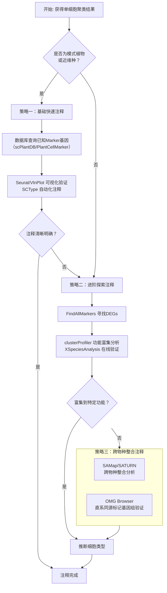

# 植物单细胞注释

- 基于marker基因。可视化细胞类型特异marker基因，可视化那些与拟南芥同源参考基因，如果有对应的细胞类型和基因的列表，可以用sctype做定量的注释
- 基于参考单细胞数据。singler，或者基于harmony和scvi做embedding后标签转移
- 跨物种注释。SAMap和SATRUN
- 基于功能富集注释。FindAllMarkers或FindConservedMarkers的结果做clusterprofile富集。使用在线网站XSpeciesAnalysis
- 数据库，scPlantDb等

植物单细胞注释的难点在于：模式物种有成熟的标记基因库，而非模式物种往往缺乏参考数据。以下流程整合了从模式到非模式、从简单到复杂的多种策略，你可以根据手头数据情况灵活组合使用。

---

### 🌱 第一阶段：基础快速注释

此阶段适用于已有较明确细胞类型预期的样本，特别是模式植物。核心是“借”——借已知的marker基因和参考数据集。

-   **A. 基于已知标记基因 (Marker Gene)**：这是最经典、最直接的方法，也是所有注释的起点。
    -   **模式植物**: 直接利用**拟南芥、水稻、玉米**等已发表文献中的成熟marker基因列表。可视化最常用的方法是**t-SNE/UMAP图**和**小提琴图**，直观查看特定基因在各细胞群的表达分布。
    -   **非模式植物**: 采用**同源基因转换**策略。将拟南芥等近缘模式物种的marker基因序列在目标物种的基因组中进行BLAST比对，找到对应的同源基因。例如，研究毛竹时，可以查找其根部与拟南芥和水稻根部marker基因的同源物。
    -   **自动化定量注释**: 如果你有一个格式良好的**细胞类型-标记基因列表**，可以使用 **`SCType`** 等工具。它基于已知marker基因集对每个细胞进行打分，实现快速、定量的自动化注释，能有效减少主观性。
    -   **数据库支持**:
        -   **scPlantDB**: 整合了17个物种、超2.5M个细胞的数据，提供交互式基因表达可视化和基于marker的细胞类型鉴定工具。
        -   **PlantCellMarker**: 收录拟南芥、水稻等6种植物的81，117个实验验证过的marker基因。
        -   **PlantscRNAdb**: 收录15种植物的114，770个marker基因。
        -   **PsctH**: 除marker外，还提供实验方案和分析流程指导。

-   **B. 基于参考数据集 (Reference-based)**：当你的样本与已有的高质量单细胞图谱相似时，此方法非常高效。
    -   **`SingleR`**：经典的单细胞注释工具，通过计算测试数据与参考数据集中细胞的相似度（如Spearman相关性）来推断细胞类型。它已整合到 **`scPlant`** 框架中，可直接使用。
    -   **`Harmony` / `scVI` + 标签转移**: 当参考数据和查询数据存在批次效应时，先用**`Harmony`**或**`scVI`**等算法将两者对齐到共同的低维嵌入空间，再通过**Seurat的`FindTransferAnchors`**等功能，将参考数据的细胞类型标签“迁移”到查询数据上。

---

### 🌿 第二阶段：进阶探索注释

当基础方法失效或希望进行更深入的挖掘时（常见于研究较少的非模式植物或全新组织），需要转向更主动的探索性分析。

-   **C. 基于功能富集分析 (Functional Enrichment)**：这是为未知细胞群“定性”的核心方法。
    -   **核心逻辑**：找到某个细胞群**高表达的基因**（`FindAllMarkers`），分析这些基因主要参与哪些生物学功能。如果一群细胞高表达与“光合作用”相关的基因，它们就很可能是**叶肉细胞**。
    -   **工具**：使用 **`clusterProfiler`** 进行GO、KEGG等功能富集分析。
    -   **在线资源**：**`XSpeciesAnalysis`** 网站专门为此设计，无需编程即可进行跨物种的功能富集分析。
    -   **湿实验验证**: 对于通过这种方法推断出的关键细胞类型，最终结论需依赖**原位杂交**或**qPCR**等实验进行验证。

-   **D. 数据库辅助验证**：在分析过程中，反复交叉验证是确保准确性的关键。
    -   **OMG Browser (Orthologous Marker Groups Browser)**: 2025年新工具，其独特优势在于不依赖单个基因，而是分析**直系同源标记基因组**。如果你的细胞群与参考数据集中某个细胞群共享大量直系同源标记基因，即使单个基因不保守，也能准确推断出细胞类型。
    -   **scPlantDB**：再次提及，因其功能强大，既可作为marker查询库，也可作为参考注释依据。

---

### 🔬 第三阶段：跨物种与整合注释

这是单细胞生物学最具挑战和前沿的方向，旨在揭示细胞类型的进化保守性。

-   **E. 跨物种数据整合**：当你的物种没有任何可用的先验知识时，这是唯一出路。
    -   **`SAMap`**：基于基因序列同源性和表达相似性构建跨物种细胞图谱。一项2025年的研究系统评估了9种方法，认为**`SAMap`在整合科级以上远缘物种时表现优异**，特别适合构建跨物种的细胞类型进化树。
    -   **`SATURN` / `scGen`**: 同项研究表明，`SATURN`在**属内到门间**的广泛分类等级上表现稳健；`scGen`则在**纲及以下**的层级内效果更好。根据你的整合目标选择合适工具。

-   **F. 整合分析框架**
    -   **`scPlant`**: 一个专门为植物单细胞分析设计的全能框架。它整合了上述多种功能，包括自动注释、轨迹推断、跨物种整合和调控网络构建。其核心理念是提供一站式的解决方案，用户只需输入表达矩阵即可完成大部分分析任务。
    -   **`scPlantDb` 等数据库**: 不仅是查询工具，其本身也是高质量参考数据的来源，可用于构建训练集。

---

### 📊 流程总结与决策树

遇到一个新的单细胞数据集时，可以遵循以下决策路径：

这个流程从最省力的Marker基因查询开始，逐步深入到功能预测，最后到前沿的跨物种整合，希望能帮你建立起清晰的注释思路。

如果方便分享你的研究对象物种和组织类型，我可以帮你进一步细化更适合的注释路径和数据库选择。